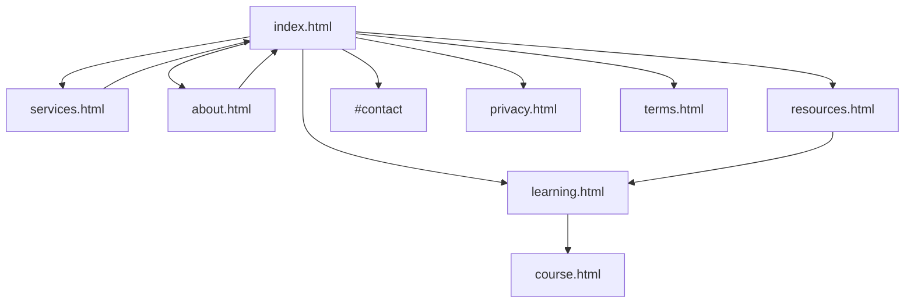

# 📊 AI RedCell Website - Comprehensive Analysis Report

> **Analysis Date:** December 17, 2025  
> **Website:** [airedcell.dev](https://www.airedcell.dev)  
> **Total Pages Analyzed:** 10 HTML Pages  
> **Total CSS Files:** 7 Files (~77KB)  
> **Total JS Files:** 12 Files (~90KB)

---

## 📋 Executive Summary

| Category                  | Score  | Status                |
| ------------------------- | ------ | --------------------- |
| **SEO**                   | 95/100 | ✅ Excellent          |
| **Accessibility**         | 80/100 | ✅ Good               |
| **Performance**           | 75/100 | ⚠️ Needs Optimization |
| **Mobile Responsiveness** | 90/100 | ✅ Excellent          |
| **Content Quality**       | 92/100 | ✅ Excellent          |
| **Technical Structure**   | 88/100 | ✅ Very Good          |

**Overall Grade: A- (87/100)**

---

## 1. 🏗️ Website Structure Analysis

### 1.1 Page Inventory

| Page      | File               | Lines | Size   | Purpose                                  |
| --------- | ------------------ | ----- | ------ | ---------------------------------------- |
| Homepage  | `index.html`       | 763   | 32.8KB | Main landing page with services, contact |
| About     | `about.html`       | 653   | 24.2KB | Founder bio, vision, mission             |
| Services  | `services.html`    | 764   | 31.4KB | Detailed service offerings               |
| Learning  | `learning.html`    | 237   | 11KB   | Course catalog                           |
| Resources | `resources.html`   | 792   | 35.8KB | Tools, frameworks, guides                |
| Course    | `course.html`      | ~400  | 9.4KB  | Individual course viewer                 |
| Privacy   | `privacy.html`     | 268   | 12.4KB | Privacy policy                           |
| Terms     | `terms.html`       | 291   | 13.5KB | Terms of service                         |
| 404       | `404.html`         | ~100  | 2.5KB  | Error page                               |
| Admin     | `admin/index.html` | -     | -      | CMS interface                            |

### 1.2 CSS Architecture

| File                     | Size   | Purpose                          |
| ------------------------ | ------ | -------------------------------- |
| `styles.css`             | 43.7KB | Core design system, components   |
| `mobile-responsive.css`  | 18.7KB | Media queries, mobile navigation |
| `mobile-premium.css`     | ~13KB  | Premium mobile effects           |
| `course-clean.css`       | ~12KB  | Course page specific styles      |
| `smooth-transitions.css` | ~2KB   | Animation utilities              |
| `overflow-fixes.css`     | ~1KB   | Layout overflow handling         |
| `content-protection.css` | ~1KB   | Content security styles          |

**Architecture:** CSS Variables + Custom CSS (No preprocessor)

### 1.3 JavaScript Modules

| File                    | Purpose                        | Dependencies |
| ----------------------- | ------------------------------ | ------------ |
| `script.js`             | Main navigation, form handling | None         |
| `matrix.js`             | Matrix rain animation          | None         |
| `home-content.js`       | CMS content loader             | None         |
| `learning.js`           | Course filtering, progress     | localStorage |
| `course-loader.js`      | Course content rendering       | None         |
| `course-cards.js`       | Dynamic course cards           | None         |
| `quiz.js`               | Quiz system                    | localStorage |
| `site-loader.js`        | Site loading utilities         | None         |
| `about-content.js`      | About page content             | None         |
| `services-content.js`   | Services page content          | None         |
| `resources-content.js`  | Resources page content         | None         |
| `content-protection.js` | Content protection             | None         |

### 1.4 Content Management

| Directory            | Files   | Format |
| -------------------- | ------- | ------ |
| `content/courses/`   | 5 files | JSON   |
| `content/home/`      | 1 file  | JSON   |
| `content/about/`     | 1 file  | JSON   |
| `content/services/`  | 1 file  | JSON   |
| `content/resources/` | 1 file  | JSON   |
| `content/settings/`  | 2 files | JSON   |

**CMS:** Netlify CMS with Git Gateway backend

---

## 2. 🔍 SEO Analysis

### 2.1 SEO Scorecard

| Element           | Implementation                        | Score |
| ----------------- | ------------------------------------- | ----- |
| Title Tags        | ✅ Unique per page, includes keywords | 10/10 |
| Meta Descriptions | ✅ Descriptive, 150-160 chars         | 10/10 |
| Keywords          | ✅ Relevant, comprehensive            | 9/10  |
| Canonical URLs    | ✅ Implemented on all pages           | 10/10 |
| Open Graph        | ✅ Complete og:tags                   | 10/10 |
| Twitter Cards     | ✅ summary_large_image                | 10/10 |
| Structured Data   | ✅ 5 JSON-LD schemas                  | 10/10 |
| robots.txt        | ✅ Comprehensive with AI crawlers     | 10/10 |
| sitemap.xml       | ✅ Complete with images               | 9/10  |
| llms.txt          | ✅ AI optimization file               | 10/10 |
| Heading Structure | ✅ Proper H1-H6 hierarchy             | 8/10  |

### 2.2 Structured Data (JSON-LD) Schemas

| Schema Type                 | Present | Content                  |
| --------------------------- | ------- | ------------------------ |
| **Person**                  | ✅      | Shehan Nilukshan details |
| **Organization**            | ✅      | AI RedCell company info  |
| **WebSite**                 | ✅      | Site metadata            |
| **FAQPage**                 | ✅      | 5 common questions       |
| **EducationalOrganization** | ✅      | Course offerings         |

### 2.3 robots.txt Configuration

```
✅ General crawling allowed
✅ AI Crawlers explicitly allowed:
   - GPTBot
   - ChatGPT-User
   - Claude-Web
   - Anthropic-AI
   - Google-Extended
   - PerplexityBot
   - Amazonbot
✅ Sensitive paths blocked: /admin/, *.json, .git/
✅ Crawl-delay: 1 second
✅ Sitemap referenced
```

### 2.4 sitemap.xml Analysis

| Content             | Status                                              |
| ------------------- | --------------------------------------------------- |
| Homepage            | ✅ Priority 1.0                                     |
| Learning page       | ✅ Priority 0.9                                     |
| Course pages (4)    | ✅ Priority 0.8                                     |
| Image sitemaps      | ✅ For logo and founder                             |
| Last modified dates | ✅ 2025-12-12                                       |
| **Missing:**        | ⚠️ Services, About, Resources, Privacy, Terms pages |

### 2.5 SEO Issues Found

| Issue                          | Severity | Recommendation                                                          |
| ------------------------------ | -------- | ----------------------------------------------------------------------- |
| Missing pages in sitemap       | Medium   | Add services.html, about.html, resources.html, privacy.html, terms.html |
| learning.html og:image path    | Low      | Change `/logo.png` to `/images/logo.png`                                |
| Large image files              | Medium   | Compress logo.png (862KB) and my-img.png (2.6MB)                        |
| No Twitter handle on all pages | Low      | Add @AIRedCell consistently                                             |

---

## 3. ♿ Accessibility Analysis

### 3.1 Accessibility Scorecard

| Element             | Implementation                   | Score |
| ------------------- | -------------------------------- | ----- |
| ARIA Labels         | ✅ On buttons, nav toggles       | 8/10  |
| Semantic HTML       | ✅ Sections, nav, main, footer   | 9/10  |
| Role Attributes     | ✅ role="banner", role="region"  | 8/10  |
| Skip Links          | ❌ Not implemented               | 0/10  |
| Focus States        | ✅ Visible focus indicators      | 8/10  |
| Color Contrast      | ⚠️ Some issues with #b0b0c0 text | 7/10  |
| Keyboard Navigation | ✅ Tab order logical             | 8/10  |
| Alt Text            | ✅ Present on images             | 8/10  |
| Form Labels         | ✅ Labels on all inputs          | 8/10  |
| Screen Reader       | ⚠️ Some areas unlabeled          | 7/10  |

### 3.2 Accessibility Strengths

- ✅ `aria-label` on hamburger menu: "Toggle navigation menu"
- ✅ `aria-expanded` attribute updates dynamically
- ✅ `aria-hidden="true"` on decorative canvas elements
- ✅ `aria-labelledby` connecting sections to headings
- ✅ `prefers-reduced-motion` media query support
- ✅ 44px minimum tap targets for mobile
- ✅ Proper form field labels
- ✅ Focus-visible styling on buttons

### 3.3 Accessibility Issues

| Issue                               | Location                    | Recommendation                    |
| ----------------------------------- | --------------------------- | --------------------------------- |
| No skip-to-content link             | All pages                   | Add skip link at top of page      |
| Low contrast secondary text         | `--text-secondary: #b0b0c0` | Increase to #d0d0e0 or higher     |
| Missing focus trap in mobile nav    | Mobile menu                 | Trap focus when menu open         |
| No live regions for form submission | Contact form                | Add aria-live for status messages |
| Canvas not described                | Hero sections               | Provide visual description        |

---

## 4. ⚡ Performance Analysis

### 4.1 Performance Scorecard

| Metric                  | Current         | Target      | Status |
| ----------------------- | --------------- | ----------- | ------ |
| Total HTML Size         | ~200KB          | <100KB      | ⚠️     |
| Total CSS Size          | ~77KB           | <50KB       | ⚠️     |
| Total JS Size           | ~90KB           | <80KB       | ⚠️     |
| Image Size (logo.png)   | 862KB           | <100KB      | ❌     |
| Image Size (my-img.png) | 2.6MB           | <200KB      | ❌     |
| Font Loading            | Google Fonts    | Self-hosted | ⚠️     |
| CSS Loading             | 5-6 stylesheets | 1-2 bundles | ⚠️     |

### 4.2 Performance Strengths

- ✅ `preconnect` for Google Fonts and gstatic
- ✅ `loading="lazy"` on founder image
- ✅ No build tools required (no npm overhead)
- ✅ CSS Variables reduce repetition
- ✅ Minimal JavaScript dependencies (no jQuery)
- ✅ localStorage for progress caching

### 4.3 Performance Issues & Recommendations

| Issue                            | Impact | Solution                                      |
| -------------------------------- | ------ | --------------------------------------------- |
| Uncompressed images              | High   | Compress to WebP format                       |
| Multiple CSS files               | Medium | Bundle into 2 files (critical + non-critical) |
| No CSS minification              | Medium | Minify for production                         |
| No JS minification               | Medium | Minify for production                         |
| Render-blocking fonts            | Medium | Use `font-display: swap` (already present)    |
| No image lazy loading on courses | Low    | Add loading="lazy" to course thumbnails       |
| Matrix animation on mobile       | Low    | Consider disabling on low-power devices       |

### 4.4 Critical Rendering Path

```
1. HTML (32KB) - ✅ Fast parse
2. CSS (5 files) - ⚠️ Multiple blocking requests
3. Fonts (Google Fonts) - ✅ Preconnected, swap
4. JS (deferred) - ✅ Non-blocking
5. Images (logo, profile) - ❌ Large, blocks LCP
```

---

## 5. 📱 Mobile Responsiveness Analysis

### 5.1 Mobile Scorecard

| Feature               | Implementation                 | Score |
| --------------------- | ------------------------------ | ----- |
| Viewport Meta         | ✅ Correct configuration       | 10/10 |
| Responsive Navigation | ✅ Hamburger menu              | 10/10 |
| Touch Targets         | ✅ 44px minimum                | 10/10 |
| Font Scaling          | ✅ Responsive typography       | 9/10  |
| Grid Layouts          | ✅ Stack on mobile             | 9/10  |
| Image Scaling         | ✅ Responsive images           | 8/10  |
| Form Usability        | ✅ Full-width inputs           | 9/10  |
| Sidebar Drawer        | ✅ Slide-out drawer            | 10/10 |
| Overflow Handling     | ✅ Horizontal scroll prevented | 9/10  |

### 5.2 Breakpoint System

| Breakpoint       | Max-Width | Adjustments                         |
| ---------------- | --------- | ----------------------------------- |
| Large Desktop    | 1200px    | Minor padding adjustments           |
| Tablet Landscape | 1024px    | Navigation condensed, sidebar 280px |
| Tablet Portrait  | 768px     | Hamburger menu, single column grids |
| Mobile Landscape | 480px     | Reduced typography, compact layouts |
| Mobile Portrait  | 380px     | Minimal margins, stacked buttons    |

### 5.3 Mobile-Specific Features

- ✅ Left slide-out sidebar for courses
- ✅ Floating toggle button (60px, bottom-left)
- ✅ Backdrop overlay when sidebar open
- ✅ Tap-to-call phone links
- ✅ WhatsApp button integration
- ✅ `prefers-reduced-motion` support
- ✅ `-webkit-text-size-adjust: 100%`

### 5.4 Mobile Issues

| Issue                  | Severity | Recommendation                  |
| ---------------------- | -------- | ------------------------------- |
| Hero 100vh on mobile   | Low      | Use 100dvh for dynamic viewport |
| Large touch actions    | Low      | Test on various devices         |
| Footer contact spacing | Low      | Consistent padding              |

---

## 6. 📝 Content Analysis

### 6.1 Content Inventory

| Content Type         | Count | Quality          |
| -------------------- | ----- | ---------------- |
| Main Pages           | 8     | ✅ Professional  |
| Course Modules       | 16+   | ✅ Comprehensive |
| Service Descriptions | 6     | ✅ Detailed      |
| Resource Links       | 24+   | ✅ Curated       |
| FAQ Items            | 5     | ✅ Relevant      |
| Legal Pages          | 2     | ✅ Complete      |

### 6.2 Content Strengths

- ✅ Clear value proposition on hero
- ✅ Professional founder biography
- ✅ Detailed service descriptions with features
- ✅ Comprehensive course content with quizzes
- ✅ Curated external resources
- ✅ Complete privacy policy and terms

### 6.3 Content Areas for Improvement

| Area          | Current        | Recommendation           |
| ------------- | -------------- | ------------------------ |
| Blog/Articles | None           | Add blog section for SEO |
| Testimonials  | None           | Add client testimonials  |
| Case Studies  | None           | Add service case studies |
| Team Page     | Single founder | Expand as team grows     |
| Pricing       | Not displayed  | Add pricing guidance     |

---

## 7. 🔗 Link Analysis

### 7.1 Internal Linking Structure



### 7.2 External Links

| Destination         | Count | Purpose              |
| ------------------- | ----- | -------------------- |
| GitHub (AI-RedCell) | 8     | Organization profile |
| LinkedIn            | 6     | Company page         |
| WhatsApp            | 5     | Direct contact       |
| FormSubmit          | 1     | Form backend         |
| Google Fonts        | 1     | Typography           |
| External Tools      | 6     | Resources section    |
| Research Papers     | 6     | Academic sources     |
| Community Links     | 6     | Learning resources   |

### 7.3 Link Attributes

- ✅ `target="_blank"` on external links
- ⚠️ Missing `rel="noopener noreferrer"` on some external links

---

## 8. 🔒 Security Analysis

### 8.1 Security Scorecard

| Feature          | Status                   |
| ---------------- | ------------------------ |
| HTTPS            | ✅ Enforced (Netlify)    |
| Content Security | ⚠️ Basic                 |
| Form Protection  | ✅ FormSubmit captcha    |
| Admin Protection | ✅ Netlify Identity      |
| Exposed Paths    | ⚠️ JSON files accessible |

### 8.2 Security Recommendations

| Issue                    | Priority | Solution                    |
| ------------------------ | -------- | --------------------------- |
| JSON content exposed     | Medium   | Add server-side protection  |
| No CSP headers           | Low      | Add Content-Security-Policy |
| Content protection basic | Low      | Consider watermarking       |

---

## 9. 📈 Recommendations Summary

### 9.1 High Priority (Do First)

1. **Compress Images**

   - logo.png: 862KB → <100KB
   - my-img.png: 2.6MB → <200KB
   - Convert to WebP format

2. **Complete Sitemap**

   - Add: services.html, about.html, resources.html
   - Add: privacy.html, terms.html

3. **Fix External Link Security**
   - Add `rel="noopener noreferrer"` to all `target="_blank"` links

### 9.2 Medium Priority

4. **Bundle CSS Files**

   - Combine into 2 files: critical.css + main.css
   - Minify for production

5. **Add Skip Link**

   - Implement skip-to-main-content for accessibility

6. **Improve Color Contrast**
   - Increase `--text-secondary` to meet WCAG AA

### 9.3 Low Priority (Nice to Have)

7. **Add Blog Section**

   - Improve SEO with regular content

8. **Add Testimonials**

   - Social proof for services

9. **Self-Host Fonts**
   - Reduce third-party dependencies

---

## 10. ✅ Conclusion

### Overall Assessment

The AI RedCell website demonstrates **excellent SEO implementation** with comprehensive structured data, proper meta tags, and AI crawler optimization. The **mobile responsiveness** is well-executed with thoughtful breakpoints and touch-friendly design.

The main areas requiring attention are:

1. **Image optimization** - Critical for performance
2. **Sitemap completeness** - Easy fix for SEO
3. **Accessibility enhancements** - Skip links and contrast

### Final Scores

| Category      | Score      | Grade  |
| ------------- | ---------- | ------ |
| SEO           | 95/100     | A      |
| Accessibility | 80/100     | B      |
| Performance   | 75/100     | C+     |
| Mobile        | 90/100     | A      |
| Content       | 92/100     | A      |
| Technical     | 88/100     | B+     |
| **Overall**   | **87/100** | **A-** |

---

_Report generated by AI analysis on December 17, 2025_
